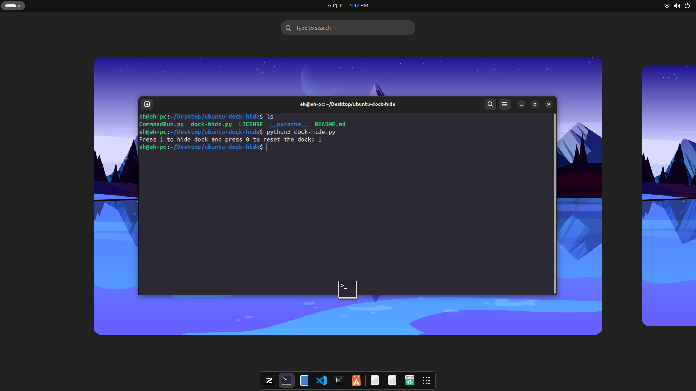
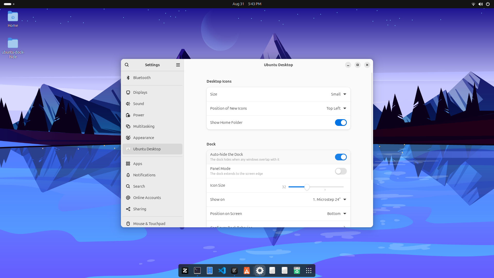
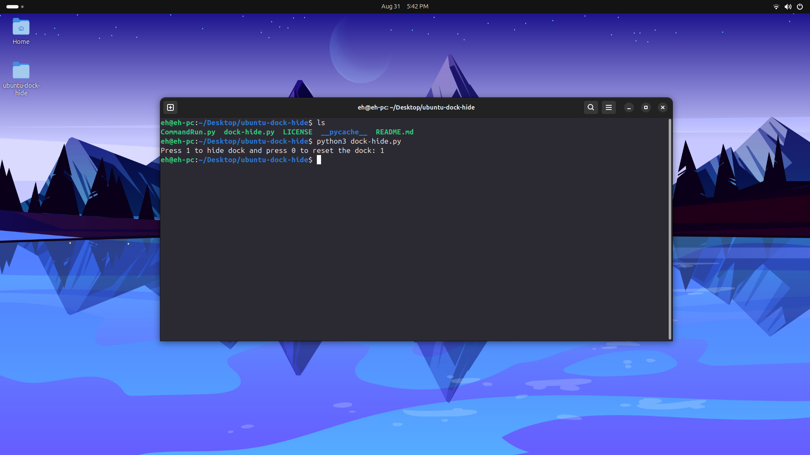

# ubuntu-dock-hide
Simple script to hide the dock panel. before running the script turn on "Auto-hide the dock" in settings 
   
# Images
Before:

After:   
turn on "Auto-hide the dock" in settings before running this script.   

   
After running the script:    

   

